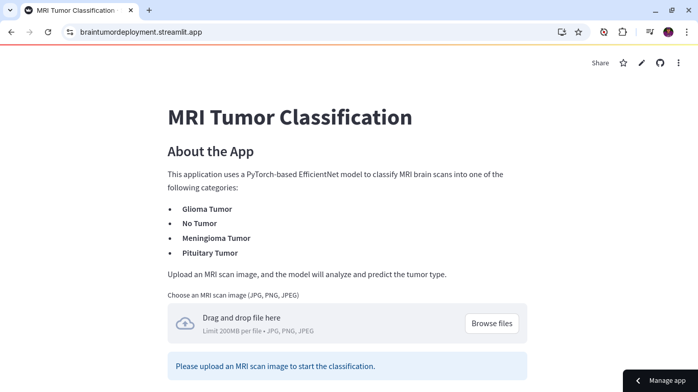

# MRI Tumor Classification

## About the App
This application leverages a PyTorch-based EfficientNet model to classify MRI brain scans into one of the following categories:

- **Glioma Tumor**
- **No Tumor**
- **Meningioma Tumor**
- **Pituitary Tumor**

Simply upload an MRI scan image, and the model will analyze it to predict the tumor type.

---

## Features
- **User-friendly interface**: Upload MRI scans in commonly used formats (JPG, PNG, JPEG).
- **Efficient and accurate classification** using a pre-trained EfficientNet model.
- **Real-time predictions** for quick analysis.

---

## How to Use
1. **Choose an MRI scan image**
   - Supported formats: JPG, PNG, JPEG
   - File size limit: 200MB

2. **Upload the image**
   - Drag and drop your file into the app.

3. **View Results**
   - The app will display the uploaded image along with the raw model predictions and the tumor classification result.

---

## Screenshots
### Home Screen


### Uploading an MRI Image and Predicting Results


---

## Raw Model Predictions
Example output from the model:
```text
[19.53183937072754, -53.19132995605469, -115.8001480102539, -4.080233097076416]

Tumor Type
```

The model assigns scores to each category, and the category with the highest score is selected as the predicted tumor type.

---

## Deployment
The application is deployed and accessible via Streamlit. You can try it out here:

🔗 **[MRI Tumor Classification Deployment](https://braintumordeployment.streamlit.app/)**

---
---

## Notes
- **Deprecation Notice**: The `use_column_width` parameter for image display is deprecated. Future updates will replace it with the `use_container_width` parameter.
- For best results, ensure the uploaded MRI scan is of high quality and correctly formatted.

---

## Requirements
To run the application locally, you'll need:
- Python 3.8+
- PyTorch
- Streamlit
- EfficientNet library

Install dependencies using the following command:
```bash
pip install -r requirements.txt
```

---

## Acknowledgments
Special thanks to the developers and contributors who made this project possible by providing tools and frameworks for deep learning and web deployment.

---

## License
This project is licensed under the MIT License. See the [LICENSE](LICENSE) file for details.
